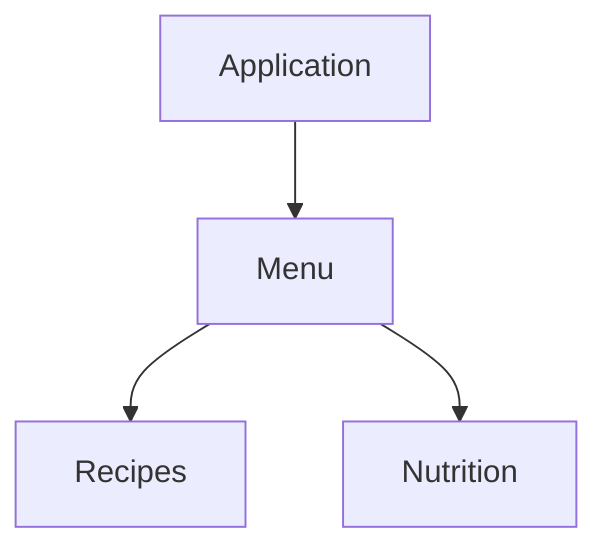
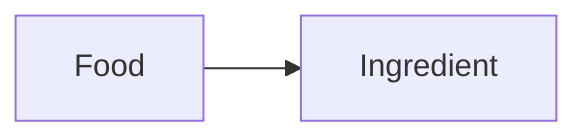
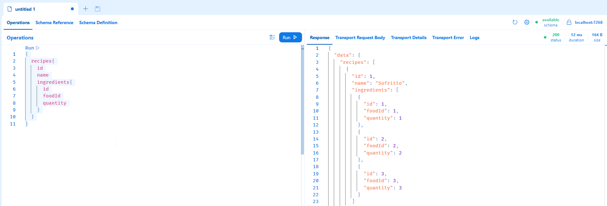
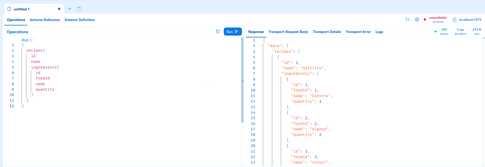

# POC.GraphQL.Gtw

Use the schema stitching with the [Hot Chocolate](https://chillicream.com/docs/hotchocolate) library to create an API Gateway and combine different schema together.

## Scenario

We are designing architecture with different microservices who serve a meal recipes mobile application:
- The `Nutrition` service: manage the food and there information, for example there nutritional values.
- The `Recipes` service: combines food reference together and describe action to complete a meal.
- The `Menu` service: which is the `Api Gateway` combining the recipes and nutrition model together and offering a full model of data.



The `Recipes` service expose an `Ingredient` model. This `Ingredient` model refers a `Food` entity from the `Nutrition` service.



The objective is to retrieve, with the schema stitching technics, from the Api Gateway, an extended `Ingredient` model containing all the `Food` properties referenced.

## Create your solution

Create a new repository with the solution file: 

```shell
dotnet new sln -o Poc.GraphQL.Gtw
cd Poc.GraphQL.Gtw
```

### Nutrition service

Run the following commands to create the `Nutrition` web api:

```shell
dotnet new web -o Poc.GraphQL.Nutrition
dotnet sln add Poc.GraphQL.Nutrition
```

Import the `Hotchocolate` library: 

```shell
dotnet add Poc.GraphQL.Nutrition package HotChocolate.AspNetCore
```

### Recipes service

Run the following commands to create the `Recipes` web api:

```shell
dotnet new web -o Poc.GraphQL.Recipes
dotnet sln add Poc.GraphQL.Recipes
```

Import the `Hotchocolate` library:

```shell
dotnet add Poc.GraphQL.Recipes package HotChocolate.AspNetCore
```

### Menu service

Run the following commands to create the `Menu` web api:

```shell
dotnet new web -o Poc.GraphQL.Menu
dotnet sln add Poc.GraphQL.Menu
```

Import the `Hotchocolate` library:

```shell
dotnet add Poc.GraphQL.Menu package HotChocolate.AspNetCore
dotnet add Poc.GraphQL.Menu package HotChocolate.Stitching
```

Note that this time `HotChocolate.Stitching` package added additionally because the `Menu` service is the `Api Gateway`.

At this point you can open your solution and see the three project within:

```shell
.\Poc.GraphQL.Gtw.sln
```

## Build the Nutrition service

### Food entity 

In the `Poc.GraphQL.Nutrition` project, create a new `Entities` directory with a `Food` class within and paste the code below:

```csharp
namespace Poc.GraphQL.Nutrition.Entities;

public record Food(int Id, string Name);
```

### Query

At the root of the project, create a new `Query` class and paste the following code: 

```csharp
using Poc.GraphQL.Nutrition.Entities;

namespace Poc.GraphQL.Nutrition;

public class Query
{
    private readonly IEnumerable<Food> _food = new List<Food>()
    {
        new(1, "Carotte"),
        new(2, "Oignon"),
        new(3, "Celeri")
    };

    public IEnumerable<Food> Foods()
        => _food;

    public Food Food(int id)
        => _food.Single(food => food.Id == id);
}
```

This code exposes two methods: 
- one to retrieves all the existing foods
- the other to retrieves food by its `id`

Note that this example mock the storage with an hardcoded list of food entity.

### Build the web api

In the `Program` class, 

- use the `AddGraphQLSever`and the `AddQueryType<Query>` methods add the GraphQL endpoint and query to your application:

```csharp
builder.Services
    .AddGraphQLServer()
    .AddQueryType<Query>();
```

- replace the `app.MapGet("/", () => "Hello World!")` line by `app.MapGraphQL()` to expose the GraphQL features with HotChocolate.

### Run the web api

At this point you can build and run the web api. Execute the following command to run the application, then browse the app at the following URL `https://localhost:{port}/graphql`. You can find the port value in the log after executing the `run` command.

```csharp
dotnet run --project .\Poc.GraphQL.Nutrition\Poc.GraphQL.Nutrition.csproj
```

You should see the BananaCakePop client interface. This client allows you to query and explore the web api. 

1. Click on the `Create document`:


2. Click on `Apply` in connection settings popup: 


3. Paste and run the following query :

```graphql
{
  foods {
    id
    name
  }
}
```

The image below shows you the final state of the test you should have.


## Build the Recipes service.

### Entities

At the root of the `Poc.GraphQL.Recipes` project, create a new `Entities` directory and add two new classes `Ingredient` and `Recipes` with the code below:

```csharp
namespace Poc.GraphQL.Recipes.Entities;

public record Ingredient
{
    public int Id { get; set; }
    public int FoodId { get; set; }
    public decimal Quantity { get; set; }
}
```

Where the `FoodId` property contains the identifier reference of `Food` from the `Nutrition` service.

```csharp
namespace Poc.GraphQL.Recipes.Entities;

public record Recipe
{
    public int Id { get; set; }
    public string Name { get; set; }
    public ICollection<Ingredient> Ingredients { get; set; }
}
```

### Query

At the root of the `Poc.GraphQL.Recipes` project, create a new `Query` class and paste the code below: 

```csharp
using Poc.GraphQL.Recipes.Entities;

namespace Poc.GraphQL.Recipes;

public class Query
{
    private IEnumerable<Recipe> _recipes = new List<Recipe>()
    {
        new Recipe()
        {
            Id = 1, Name = "Sofritto", Ingredients = new List<Ingredient>()
            {
                new Ingredient() { FoodId = 1, Id = 1, Quantity = 1 },
                new Ingredient() { FoodId = 2, Id = 2, Quantity = 2 },
                new Ingredient() { FoodId = 3, Id = 3, Quantity = 3 }
            }
        }
    };

    public IEnumerable<Recipe> GetRecipes() => _recipes;

    public Recipe? GetRecipe(int id)
        => _recipes.SingleOrDefault(recipe => recipe.Id == id);
}
```

This exposes two queries : 
- Get all recipes.
- Get recipe by `id`.

Note that the list of recipes is hardcoded in the class. This list contains `Ingredient` which refer to the `Food` entity through its `FoodId` property.

### Build the web api

In the `Program` class,

- use the `AddGraphQLSever`and the `AddQueryType<Query>` methods add the GraphQL endpoint and query to your application:

```csharp
builder.Services
    .AddGraphQLServer()
    .AddQueryType<Query>();
```

- replace the `app.MapGet("/", () => "Hello World!")` line by `app.MapGraphQL()` to expose the GraphQL features with HotChocolate.

### Run the web api

At this point you can build and run the web api. Execute the following command to run the application, then browse the app at the following URL `https://localhost:{port}/graphql`. You can find the port value in the log after executing the `run` command.

```csharp
dotnet run --project .\Poc.GraphQL.Recipes\Poc.GraphQL.Recipes.csproj
```

You should see the BananaCakePop client interface. This client allows you to query and explore the web api. 

1. Click on the `Create document`:


2. Click on `Apply` in connection settings popup:


3. Paste and run the following query :

```graphql
{
  recipes{
    id
    name
    ingredients{
      id
      foodId
      quantity
    }
  }
}
```

The image below shows you the final state of the test you should have.



## Build the Menu service

The `Menu` service is the `Api Gateway`. Its role is to gather the model of the two services `Nutrition` and `Recipe` and to expose a full model where it's possible to retrieve the `Name` property of the `Food` entity referenced from the `Ingredient` entity.

### Build the Api Gateway

In the `program.cs`:

1. Add a new HttpClient which reference the two `Nutrition` and `Recipe` services. Don't forget to adapt the port number value to your services:

```csharp
const string Recipes = "recipes";
const string Nutrition = "nutrition";

var builder = WebApplication.CreateBuilder(args);

builder.Services
    .AddHttpClient(Nutrition, (_, client) => client.BaseAddress = new Uri("https://localhost:{port}/graphql/"));
builder.Services
    .AddHttpClient(Recipes, (_, client) => client.BaseAddress = new Uri("https://localhost:{port}/graphql/"));
```

Note that each client has a name. This name is important and will be used later.

2. Add services, where
   - `AddGraphQLServer` add the GraphQL enpoints,
   - `AddQueryType(d => d.Name("Query"))` add a new `Query` type. The `Query` type is empty at this time and will be extended further,
   - `AddRemoteSchema` add the dependency to an external (GraphQL) service,
   - `AddTypeExtensionsFromFile` extend type from file. This part is used to extend especially the `Query` type,
   - `ModifyRequestOptions` allows the developer to retrieve exception information.

```csharp
builder.Services
    .AddGraphQLServer()
    .AddQueryType(d => d.Name("Query"))
    .AddRemoteSchema(Recipes, ignoreRootTypes: true)
    .AddRemoteSchema(Nutrition, ignoreRootTypes: true)
    .AddTypeExtensionsFromFile("./Stitching.graphql")
    .ModifyRequestOptions(options => options.IncludeExceptionDetails = true);
```
3. Use the GraphQL middelware with `app.MapGraphQL` methods.

### Stitching

At the root of the project `Poc.GraphQL.Menu`, create a new file `Stitching.graphql` and paste the code below: 

```graphql
extend type Query {
    recipe(id: Int!): Recipe @delegate(schema: "recipes", path: "recipe(id: $arguments:id)")
    recipes: [Recipe!]! @delegate(schema: "recipes")
}
```

This will extend the `Query` type defines in `program.cs` (see below) with to new methods: 
- `recipe(Id: Int!): Recipe` to retrieve a `Recipe` by its `id`. 
  - The `@delegate` instruction tells HotChocolate where find data to resolve the query. In this case, it's from the recipe schema (define below), from the path `recipe(id: $arguments:id)`. 
  - The `$argument:id` tells HotChocolate to use the `id` property of the argument pass to the call.
- `recipes: [Recipe!]!`
  - The `@delegate` instruction tells HotChocolate where find the data to resolve the query. There's no `path` parameter in this case because it's exactly the same à the original call.

Then paste the code below: 

```graphql
extend type Ingredient {
    name: String!
    @delegate(
        schema: "nutrition",
        path: "food(id: $fields:foodId).name")
}
```

This will extend the `Ingredient` type received from the `Recipe` service with a new `string` property `name`. This property is fill by delegate a call to the `Nutrition` service. 
- The `@delegate` instruction tells HotChocolate to call the `Nutrition` service 
- The `path` parameter tells HotChocolate to  
  - call the `food(id)` methods
  - with the value of the `foodId` field of the `Ingredient` as parameter
  - and to get `name` property of the response.

## Run the Api Gateway

Before running your project, be sure that the `Nutrition` and `Recipe` services are up and running.

Start you project and browse to the GraphQL client URL `http://localhost{port}/graphql`: 

```shell
dotnet run --project Poc.GraphQL.Menu\Poc.GraphQL.Menu.csproj
```

1. Click on the `Create document`:


2. Click on `Apply` in connection settings popup:


3. Paste and run the following query :

```graphql
{
  recipes{
    id
    name
    ingredients{
      id
      foodId
      name
      quantity
    }
  }
}
```

The image below shows you the final state of the test you should have.


