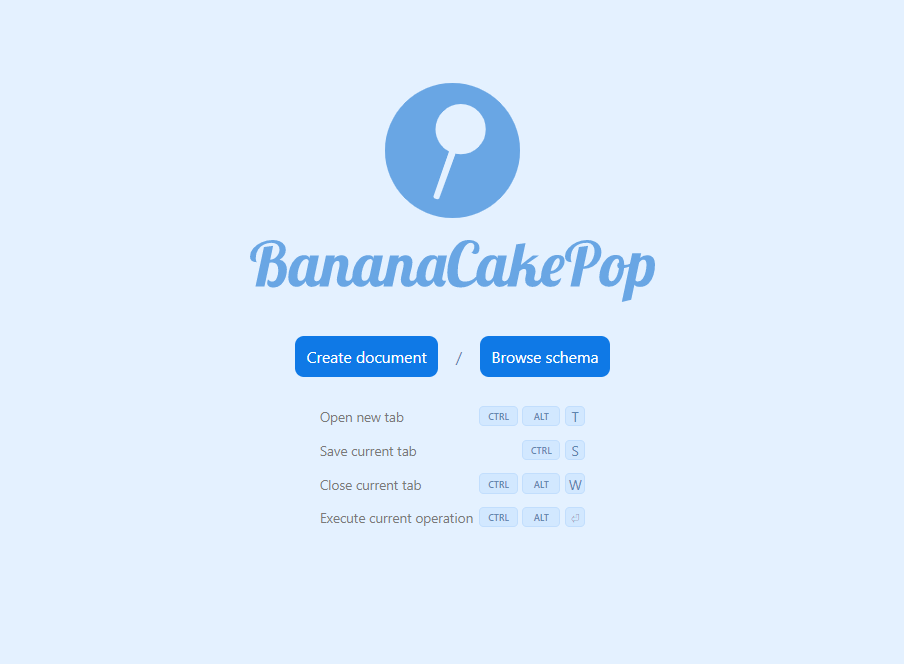
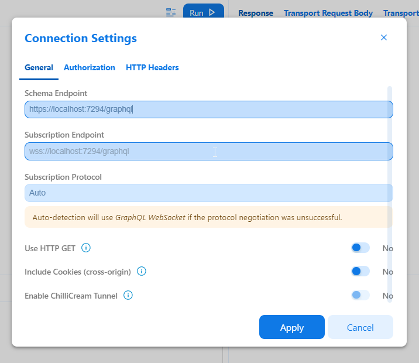
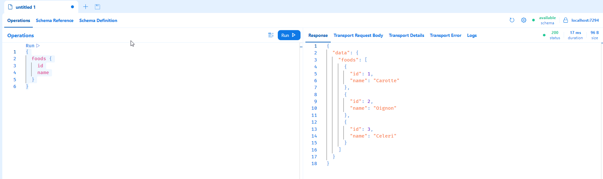

# POC.GraphQL.Gtw

Use the schema stitching with the [Hot Chocolate](https://chillicream.com/docs/hotchocolate) library to create an API Gateway and combine different schema together.

## Scenario

We are designing architecture with different microservices who serve a meal recipes mobile application:
- The `Nutrition` service: manage the food and there information, for example there nutrional values.
- The `Recipes` service: combines food reference together and describe action to complete a meal.
- The `Menu` service: which is the `Api Gateway` combining the recipes and nutrition together and offering a full model of data.

## Create your solution

Create a new repository with the solution file: 

```shell
dotnet new sln -o Poc.GraphQL.Gtw
cd Poc.GraphQL.Gtw
```

### Nutrition service

Run the following commands to create the `Nutrition` web api:

```shell
dotnet new web -o Poc.GraphQL.Nutrition
dotnet sln add Poc.GraphQL.Nutrition
```

Import the `Hotchocolate` library: 

```shell
dotnet add Poc.GraphQL.Nutrition package HotChocolate.AspNetCore
```

### Recipes service

Run the following commands to create the `Recipes` web api:

```shell
dotnet new web -o Poc.GraphQL.Recipes
dotnet sln add Poc.GraphQL.Recipes
```

Import the `Hotchocolate` library:

```shell
dotnet add Poc.GraphQL.Recipes package HotChocolate.AspNetCore
```

### Menu service

Run the following commands to create the `Menu` web api:

```shell
dotnet new web -o Poc.GraphQL.Menu
dotnet sln add Poc.GraphQL.Menu
```

Import the `Hotchocolate` library:

```shell
dotnet add Poc.GraphQL.Menu package HotChocolate.AspNetCore
dotnet add Poc.GraphQL.Menu package HotChocolate.Stitching
```

Note that this time `HotChocolate.Stitching` package added additionally because the `Menu` service is the `Api Gateway`.

## Build the Nutrition service

Open your solution: 

```shell
.\Poc.GraphQL.Gtw.sln
```

### Food entity 

In the `Poc.GraphQL.Nutrition` project, create a new `Entities` directory with a `Food` class within and paste the code below:

```csharp
namespace Poc.GraphQL.Nutrition.Entities;

public record Food(int Id, string Name);
```

### The Query

At the root of the project, create a new `Query` class and paste the following code: 

```csharp
using Poc.GraphQL.Nutrition.Entities;

namespace Poc.GraphQL.Nutrition;

public class Query
{
    private readonly IEnumerable<Food> _food = new List<Food>()
    {
        new(1, "Carotte"),
        new(2, "Oignon"),
        new(3, "Celeri")
    };

    public IEnumerable<Food> Foods()
        => _food;

    public Food Food(int id)
        => _food.Single(food => food.Id == id);
}
```

This code exposes two methods: 
- one to retrieves all the existing foods
- the other to retrieves food by its `id`

Note that this example mock the storage with an hardcoded list of food entity.

### Build the web api

In the `Program` class, 

- use the `AddGraphQLSever`and the `AddQueryType<Query>` methods add the GraphQL endpoint and query to your application:

```csharp
builder.Services
    .AddGraphQLServer()
    .AddQueryType<Query>();
```

- replace the `app.MapGet("/", () => "Hello World!")` line by `app.MapGraphQL()` to expose the GraphQL features with HotChocolate.

### Run the web api

At this point you can build and run the web api. Execute the following command to run the application, then browse the app at the following URL `https://localhost:{port}/graphql`. You can find the port value in the log after executing the `run` command.

```csharp
dotnet run --project .\Poc.GraphQL.Nutrition\Poc.GraphQL.Nutrition.csproj
```

You should see the BananaCakePop client interface. This client allows you to query and explore the web api. 

1. Click on the `Create document`:



2. Click on `Apply` in connection settings popup: 



3. Paste the following query and see the response returns:

```graphql
{
  foods {
    id
    name
  }
}
```

The image below shows you the final state of the test you should have.



## Build the Recipes service.

##